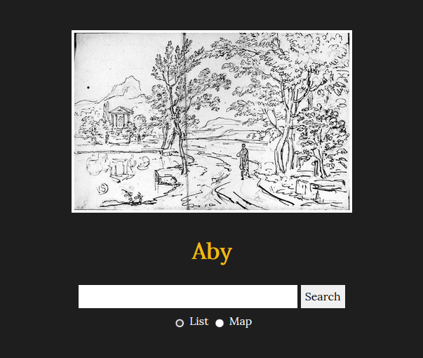

# Final Project: SI 507 (Intermediate Programming), Fall 2019

## About
Aby is an art discovery app built with museum data. At the moment, it has almost 70,000 records from the Metropolitan Museum of Art, the Rijksmuseum in the Netherlands, and several art museums in Belgium. Currently you can search by title and museum name.

The app uses Flask, plotly, sqlite, asynchronous API requests, and OAI-PMH metadata harvesting protocols.

## How to run
1. Run the app with `python main.py` and navigate to `localhost:5000`. I spent much more time and intellectual effort designing the list view (see below on relevance ranking) than the map view, which is pretty basic right now. From the list results view, you can click to the page view, and then eventually you can click through to the museum website.
2. Test the app with `python main-test.py`
3. To rebuild the dataset, use `harvest.py` with the right suffix
  * `--init` will DELETE the 70,000 records that took hours to harvest
  * `--resume` will start or continue harvesting metadata from three APIs and putting it in the database. It uses resumption tokens (for the European museums) or stored object IDs (for the Met) to pick up where it left off.
  * `--index` will create three additional tables in the database, using the relevancy algorithm explained below

## Data sources
I was able to successfully harvest data from four APIs:
* Rijksmuseum - 39,180 records
* Metropolitan Museum of Art - 13,861 records
* Flemish Art Collection - 15,886 records
* Google Places

## Code structure and processing
Aby basically follows the MVC framework. While the app is running, `main` is the controller and `model` the model, with several arms including `apis`, `aio`, and `refresher`. But while building the database, `harvest` is the controller, and in addition to `model`, `apis`, and `aio`, it depends on `formats` and `relevance`.

Data is first processed from the different API formats (XML and JSON) into objects representing artworks, using a metadata schema called [CDWA](https://www.getty.edu/research/publications/electronic_publications/cdwa/), maintained by the Getty. This required making a separate map for each museum onto the common data structure. See the `museums` directory.

The hardest thing was to come up with an algorithmic way to order them by relevance, even though they come from very different art collections. Once the artworks are put into a SQL table, Aby indexes them according to a basic algorithm explained by Karen Markey in chapter 8 of ["Online Searching" (Lanham: Rowman, 2019)](http://www.worldcat.org/oclc/1128848252). A given search term is treated as more important if it appears infrequently in the database. If a user searches for "Aardvark", the system will push works with that word higher on the results list, but not so much for a common word like "landscape." See `relevance` and `model.rebuild_index` for the way I use multiple-to-multiple SQL relations to represent Markey's algorithm.

## Note
I was not able to incorporate the APIs of the RMN and the Walters Art Museum, as I said in my proposal, because the RMN was poorly structured, and the Walters did not offer a harvesting option. While an earlier version of my project was able to access all five of these art sources using asynchronous requests, it took 4-6 seconds to return results, and this project required a database.
